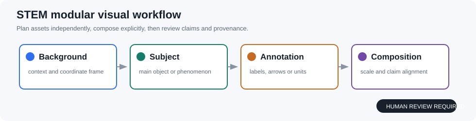

<div align="center">

# Paper Harness Undergraduate

**面向本科毕业论文与科研初学者的研究工作台**

[简体中文](README.md) · [English](README.en.md) · [日本語](README.ja.md)

</div>

---

<p align="center">
  
</p>

<p align="center">
  <a href="docs/getting-started-zh.md">从零开始教程</a> · 
  <a href="docs/undergraduate-edition-zh.md">工作流说明</a> · 
  <a href="demo/index.html">离线 Demo</a>
</p>

## 🎯 这个仓库解决什么问题？

老师给了你一个题目，但你不知道：

- 怎么开始读文献？
- 怎么设计一组**能做完**的实验？
- 哪些结论可以写、哪些不能乱写？
- 怎样保存过程记录，让导师一目了然？

**Paper Harness Undergraduate** 把这一切拆解成清晰的步骤，带你一步一步往前走，而不是直接扔给你一篇“自动生成的论文”。

它的核心工作流是：

> **课题范围** → 本地资料/文献 → 综述矩阵 → 可检验方案 → 导师批准的 baseline 实验 → 证据检查 → 草稿与完整性检查

**关键原则：**
- 每个结论都绑定来源（文献页码、实验日志、导师确认）
- 所有实验默认 **dry‑run**，必须经你（和导师）批准后才真正执行
- 不自动断言创新，不伪造数据，不绕过查重

---

## ⚙️ 它怎么帮你？

这个工具不是黑盒，而是一套**可交互的引导流程**。它内置了多个专用 Agent，各自负责一个阶段：

| Agent | 做什么 | 输出什么 |
| :--- | :--- | :--- |
| **Undergraduate‑Guide** | 把课题翻译成“综述优先、基线明确、变量有限”的实验计划 | 研究路线图 + 实验清单 |
| **Knowledge‑Base** | 本地存储长文本分块，避免重复塞入大段资料 | 可检索的本地知识索引 |
| **Similarity‑Checker** | 初步重合筛查，帮你回看引用与改写（不替代学校查重） | 相似度报告 + 待修改提示 |
| **Authorship‑Editor** | 提示贡献表达和 AI 使用披露 | 作者声明草稿 |
| **Claim‑Auditor** | 每条论文 claim 必须指向文献或实验 artifact | 可追溯的 claim 清单 |

所有阶段都有明确的输入/输出和人工确认点，你随时可以暂停、检查、修改，再继续。

---

## 🚀 10 分钟快速上手：从零到第一个实验计划

```bash
python3 -m venv .venv
source .venv/bin/activate
python -m paper_harness.cli init examples/stem_project/project.json --output ./runs/my-thesis
python -m paper_harness.cli run ./runs/my-thesis/project.json
```

高风险阶段会返回 `approval-required`。先阅读 `artifacts/` 下的结果，然后：

```bash
python -m paper_harness.cli approve ./runs/my-thesis/project.json --stage experiment
python -m paper_harness.cli run ./runs/my-thesis/project.json
```

> 完整的逐步讲解、常见错误和结果阅读方式，请阅读 **[从零开始教程](docs/getting-started-zh.md)**。

---

## 🌐 非理工科 / 非实验类课题怎么办？

如果你做的是**纯综述、社科调研、案例分析**，或者暂时不需要跑代码，同样适用。你只需要：

- 在 `project.json` 中设置 `"mode": "literature_only"`  
- 系统会自动跳过实验槽，专注于文献检索、知识卡片和综述矩阵

最终产出的是**研究笔记、分类框架、证据清单和综述草稿**，而不是实验代码。  
这种方式已经在多个文科和商科项目中验证过，适合那些“先读完文献再决定下一步”的场景。

---

## 🧠 这个工具从哪来？——真实项目的实战沉淀

> **Paper Harness Undergraduate** 不是凭空写出来的教材示例，而是从真实研究场景中提炼出来的通用脚手架。

它的设计理念和核心架构，脱胎于同一个团队在 **MindPaw**（具身智能控制研究框架）和 **Paper Harness Professional** 中的成功实践。MindPaw 在 GitHub 上已获得 **2.4k Stars** 和 **2.2k Forks**，证明了这套“证据驱动 + 人工审批 + 可复现”的方法论在真实科研中的价值。

我们把其中**面向本科生的轻量化、引导式版本**独立出来，去掉了多 GPU、CV 组合探索等专业模块，保留了最核心的**文献管理、实验计划、证据绑定和写作辅助**能力，让本科同学也能用上专业级的研究基础设施。

---

## 📂 它能帮你产出什么？

| 你的输入 | Harness 自动组织 | 最终产物 |
| :--- | :--- | :--- |
| 课题名称 + 已有资料 | 文献检索、分块提炼、去重索引 | 本地知识库 + 文献卡片 + 研究笔记 |
| 初步研究思路 | 转化为可检验的方案和变量清单 | 实验计划表 + 基线设计 |
| 导师批准的实验配置 | 自动执行并记录全部上下文 | 可复现的实验日志 + 指标结果 |
| 实验证据 + 文献引用 | 组织表格、图表、段落和 claim 绑定 | 论文初稿草稿 + 完整性检查报告 |
| 论文完整稿 | 相似度筛查、贡献声明、AI 使用披露提醒 | 自查清单 + 待修改建议 |

---

## 🛡️ 适用边界与合规声明

- 默认 Demo 使用**合成数据**，仅验证流程，**不可作为毕业论文结果**。
- 不绕过登录、付费墙、验证码或数据库规则；所需资料请由你**合规导入**。
- 不自动投稿、不伪造引用、不自动断言创新成立。
- 真实实验默认 **dry‑run**，必须经导师/研究者批准后才可配置并执行。
- 相似度检查为本地初步筛查，**不替代学校正式查重系统**。
- AI 使用披露模块仅提示规范，**不提供规避 AI 检测的功能**。

---

## 📁 仓库结构

```text
paper_harness/       编排器、Agent、证据链和本地知识库
docs/                面向新手的教程与工作流说明
examples/            可直接修改的项目配置
demo/                无 API Key 的离线演示
tests/               无网络单元测试
```

> 需要多 GPU 的 CV 创新组合探索，请使用独立仓库 `paper-harness-cv`（专业版）。两者保持独立发布与依赖边界，可按需选用。

---

## 🔗 更多资源

- [从零开始教程](docs/getting-started-zh.md) —— 手把手带你走完第一个项目
- [工作流详细说明](docs/undergraduate-edition-zh.md) —— 每个 Agent 的合约和检查点
- [离线 Demo](demo/index.html) —— 无需 API Key 即可体验界面

---

<div align="center">

**Paper Harness Undergraduate** —— 让你的毕业论文，每一步都清晰、可追溯、有信心。  
从今天开始，用它组织你的第一个研究项目。

</div>

---
